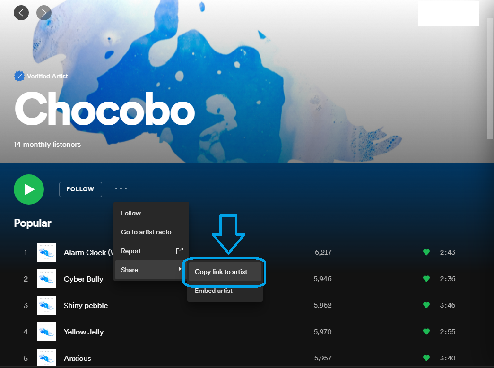
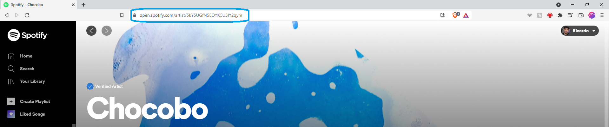
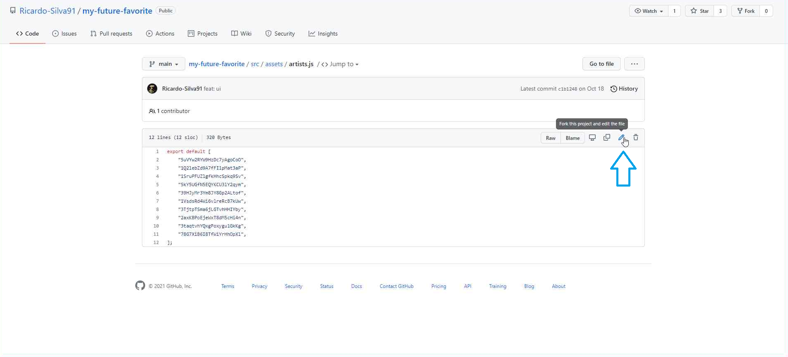
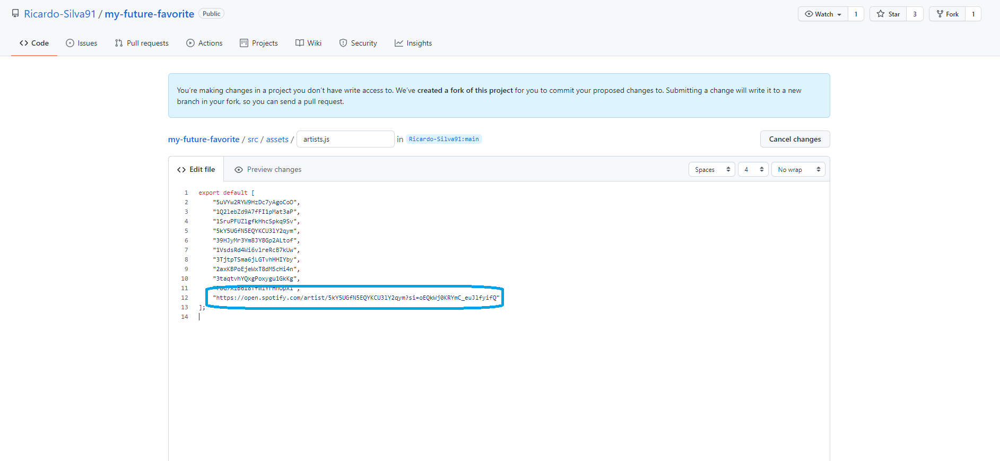
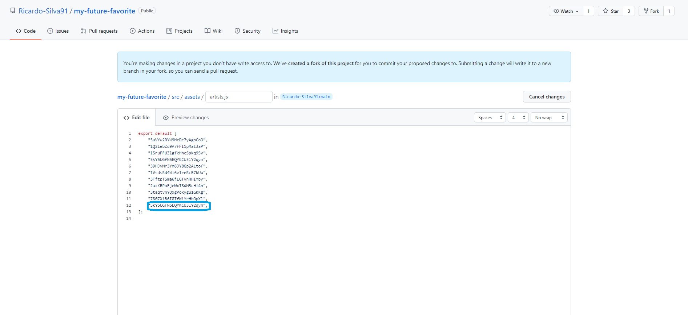
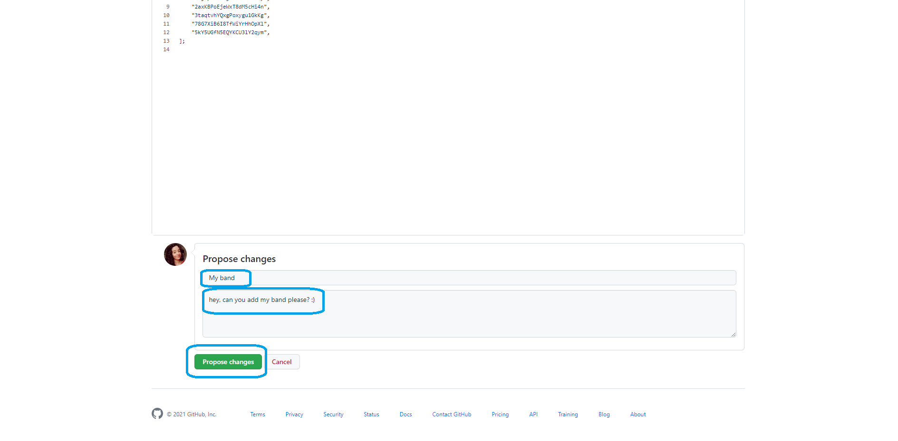
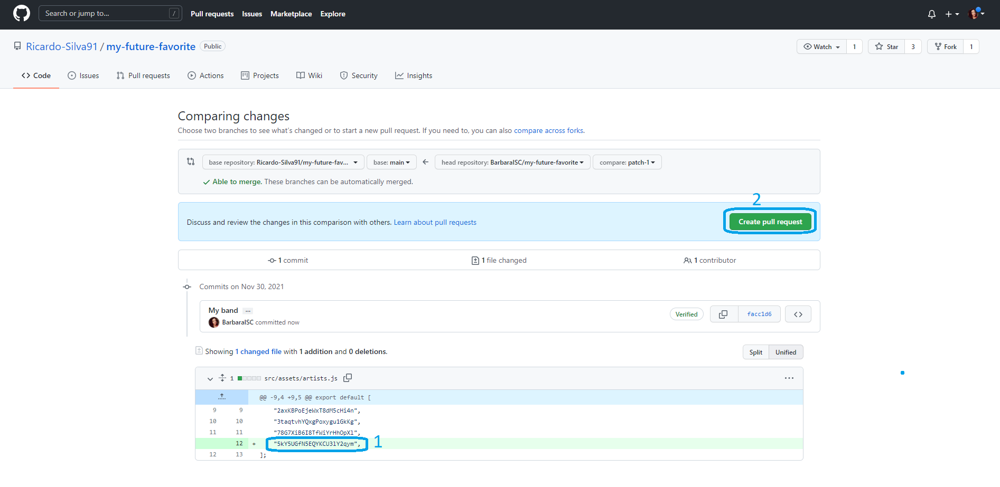
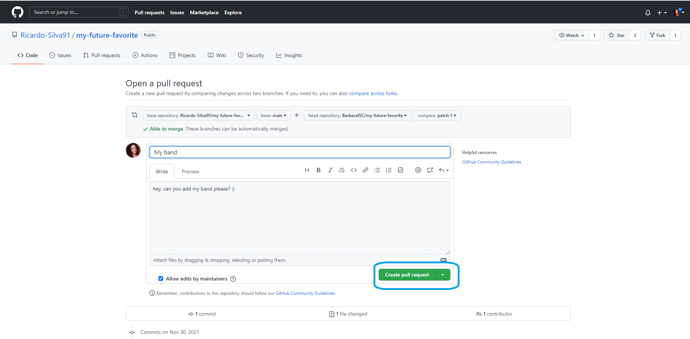

# How to submit new artists/band

If you want to submit a new Spotify profile, follow these steps.

## 1. Create a Github Account

To do this, you'll need a Github account. If you don't have one, sign up, it's easy 😌.

## 2. Get Artist link

On your Spotify app, go to the profile you want to add and click on the 'Copy link to artist' menu item to get the link on your clipboard.

Alternately, if you go to the profle on your browser, you can just copy the link from the url bar.

## 3. Open a Pull Request on this repository

To request the addition of the new Spotify profile to the catalog, go to [this page](https://github.com/Ricardo-Silva91/my-future-favorite/blob/main/src/assets/artists.js) and click on the pencil button to start editing the file.

Once the editor is open, add a new line to the list and paste the link you copied from Spotify.

Remove the "https://open.spotify.com/artist/" and "?si=something" sections of the text, leaving just the artist identifier.\
Also, don't forget to add a comma (',') at the end, it makes it easier for the reviewers 😊.

Once that's done, go to the bottom of the page and fill the 'Propose changes' form. (you don't need to fill the description field, it's optional).
Then click the 'Propose changes' button.

On the next page, check that the change is correct (1) and click the 'Create pull request' button (2).

On the last page, click the 'Create pull request' button.

And you're done 🥳.\
Once the request is accepted, you'll receive an email from github with the good news 😁.
You'll also receive an email if there are any problems, so we can solve them together 😌.

---/---

